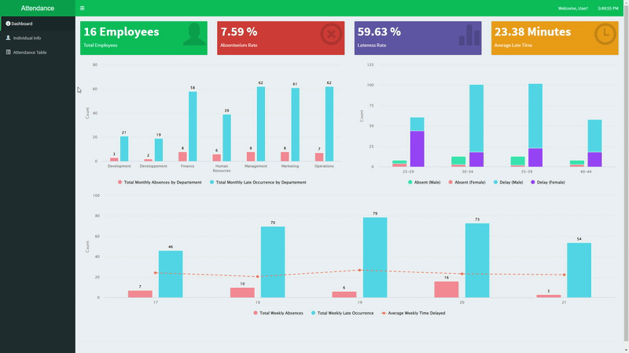

# Shiny Dashboard for Attendance Data Analysis

This repository contains a Shiny dashboard application (or webpage) for analyzing attendance data. The dashboard is built using the `shinydashboard` package in R and provides an interactive way to explore and analyze attendance records.

## Main Tab
Overview of the Attendance Data.

## Individual Info Tab
Select a specific Name and date range to see their behavior within that range.

## Data Tab
Raw Attendance Data.

